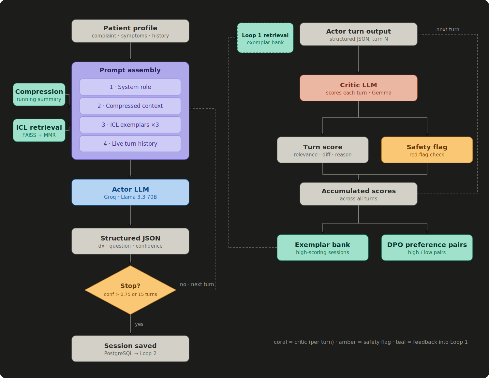

# DiffDx

An AI-powered medical diagnostic assistant that uses an actor–critic architecture to conduct and evaluate multi-turn diagnostic conversations.

## Overview

DiffDx simulates a clinical diagnostic dialogue. A patient describes their symptoms through a web portal, and an AI doctor conducts a structured conversation to narrow down a differential diagnosis — asking follow-up questions, tracking probabilities, and knowing when it has enough confidence to stop.

The system is built in three layers:

- **Actor (Loop 1)** — the doctor LLM that drives the conversation
- **Critic (Loop 2)** — an evaluator LLM that scores the actor's performance and generates training signal
- **Router (Loop 3)** — a post-session triage layer that classifies urgency and routes patients to the right care pathway

## How the Actor works

The actor is a Groq-hosted **llama-3.1-8b-instant** model prompted to behave as a diagnostic physician. Every turn it receives the patient's structured profile, the (compressed) conversation history, 3 retrieved few-shot exemplars, and the current differential with probabilities. It outputs strict JSON every turn:

```json
{
  "current_differential": [{ "dx": "migraine", "prob": 0.6 }],
  "biggest_uncertainty": "...",
  "chosen_question": "...",
  "rationale": "...",
  "confidence_to_stop": 0.71,
  "should_stop": false
}
```

The session ends when `confidence_to_stop` crosses **0.75** or after **15 turns** maximum.

- **Context compression** — older turns are summarised into a running note, keeping prompt size stable across long sessions.
- **Exemplar retrieval** — the 3 most relevant exemplars are retrieved via sentence embeddings + MMR for diversity. There are 15 curated exemplars (PE, appendicitis, DVT, CVST, pericarditis, SLE, measles, cauda equina, and more).
- **Safety screening** — a dedicated module scans every turn for red-flag symptoms and can interrupt with an emergency referral before the differential is finalised.
- **Profile updater** — a separate call extracts newly disclosed symptoms, history, and medications after each patient message and merges them into the structured profile.

## How the Critic works

After a session ends, the critic LLM reviews the full log and scores the actor on question relevance, whether the differential evolved sensibly, whether the stopping decision was appropriate, and red-flag detection.

Scores are stored alongside the session. High-scoring sessions become new exemplars, and high/low pairs become preference pairs for future DPO fine-tuning. The critic also runs **turn-level scoring** for fine-grained feedback, and a **DDxPlus evaluation harness** runs the actor against benchmark cases (with a simulated patient LLM) to measure top-1/top-3 accuracy, question efficiency, and safety recall.

## How the Router works

Loop 3 runs after a session concludes and classifies the diagnosis into a care pathway:

- **Urgency classification** — maps the top differential to one of four tiers (Emergency / Urgent / Soon / Routine) using a disease-to-specialty map covering 600+ conditions
- **Specialty routing** — identifies the correct specialty, with an ambiguity handler when the top differential is unclear
- **Suggested tests** — generates an ordered list of recommended investigations that doctors can tick off and attach results to

## Patient portal

| Feature | Detail |
| --- | --- |
| Registration & login | JWT auth with hashed passwords; supports family accounts with named dependents |
| Profile management | Stores demographics, chronic conditions, medications, and insurance details |
| Appointment booking | Browse doctors by specialty, view real-time availability, book or cancel |
| Direct booking | Book from a session report — the appointment is pre-filled with the diagnostic summary |
| File uploads | Attach PDFs and images (X-rays, lab results) before or after a session |
| Diagnostic sessions | Run a full multi-turn AI session, or a quick custom session against a manual case |
| Session reports | View the differential, suggested tests, urgency tier, and specialist routing |
| Appointment history | Past visits, AI summaries, doctor notes, prescriptions, and results in one place |
| Symptom history | Timeline view of all symptoms logged across sessions |
| Second opinion | Re-run a session or book with a different doctor from the report page |
| Prescription refills | Request refills; doctors approve or decline |
| Waitlist | Join a waitlist for fully-booked doctors and get notified when a slot opens |
| Reschedule flow | Propose a reschedule; doctors accept or counter-propose |
| Doctor ratings | Rate appointments once marked complete |
| Secure messaging | Thread-based in-app messaging with unread-count badges |

## Doctor portal

| Feature | Detail |
| --- | --- |
| Availability management | Set weekly slot templates and apply them to future weeks in one click |
| Blocked dates | Mark holidays or non-working days so those slots never appear to patients |
| Appointment queue | View upcoming and past appointments; filter by status |
| Pre-session intake | Review the AI summary and uploaded files before entering the room |
| Clinical notes | Add SOAP notes, treatment plans, and follow-up instructions |
| Test ordering | Tick suggested tests from the AI report; record results when they return |
| Prescriptions | Issue prescriptions and manage refill requests |
| File management | Upload doctor-side documents (referral letters, imaging reports) |
| Referral issuance | Generate a referral letter pre-populated with diagnosis, urgency, and history |
| Propose reschedule | Counter-propose a new appointment time |
| Patient history view | Pull up all past sessions and notes for any patient |
| Analytics dashboard | Appointment volume, completion rate, average session length, specialty breakdown |
| Session flag | Flag any AI session for human review (feeds Loop 2 training data) |
| Waitlist management | View and manage the doctor's own waitlist queue |

## Architecture



```
Patient / Doctor browser
        │  REST + JSON
        ▼
   FastAPI (loop1/web/api.py)
        ├── Auth layer (JWT, bcrypt)
        ├── Loop 1 ─── Doctor LLM (Groq / Llama 3.3 70B)
        │               ├── Profile Updater
        │               ├── Compressor
        │               ├── Exemplar Retriever (FAISS + MMR)
        │               └── Safety Screener
        ├── Loop 2 ─── Critic LLM (OpenRouter / Gemma)
        │               ├── Turn- & session-level scorers
        │               └── DDxPlus eval harness
        └── Loop 3 ─── Router (Urgency / Specialty / Ambiguity)
        ▼
PostgreSQL (Supabase in prod, SQLite locally)
```

## Tech stack

| Layer | Technology |
| --- | --- |
| Backend API | FastAPI (Python 3.12) |
| Frontend | Vanilla HTML / CSS / JS |
| Actor LLM | Groq — `llama-3.3-70b-versatile` |
| Critic LLM | OpenRouter — Gemma |
| Embeddings | Sentence Transformers (`all-MiniLM-L6-v2`) + FAISS |
| Database | PostgreSQL (Supabase in prod) / SQLite locally |
| Auth | JWT (python-jose) + bcrypt |
| Email | Resend API |
| Deployment | Render (auto-deploy on push to `main`) |

## Running locally

```bash
cd loop1
pip install -r requirements.txt
pip install -e .
cp .env.example .env   # add GROQ_API_KEY at minimum
PYTHONPATH=src python run_web.py
```

Then open <http://localhost:8000>.

Run a headless session from the CLI with `PYTHONPATH=src python scripts/run_session.py`, or the DDxPlus eval with `PYTHONPATH=src python scripts/bake_off.py`.

## Environment variables

| Variable | Required | Description |
| --- | --- | --- |
| `GROQ_API_KEY` | Yes | Powers the actor LLM (Llama 3.3 70B) |
| `OPENROUTER_API_KEY` | No | Powers the critic LLM; critic is skipped if unset |
| `DATABASE_URL` | No | PostgreSQL connection string — falls back to SQLite if unset |
| `RESEND_API_KEY` | No | Sends appointment confirmation and reminder emails |
| `SECRET_KEY` | No | JWT signing secret — auto-generated if unset (sessions reset on restart) |

## Tests

```bash
cd loop1
pytest tests/ -v
```

Covers session lifecycle, compressor, retrieval, safety screener, profile updater, critic scorer, DDxPlus loader, routing and urgency classification, schemas, and API route integration.

## Deployment

Configured for Render via `render.yaml`. Connect the `Mhervin47/DiffDx` GitHub repo, set the environment variables in the Render dashboard, and deploy. Auto-deploys on every push to `main`. Uses PostgreSQL on Render in production and a local `diffx.db` SQLite file in development.

For more details check this out https://mhervin47.github.io/DiffDx/
